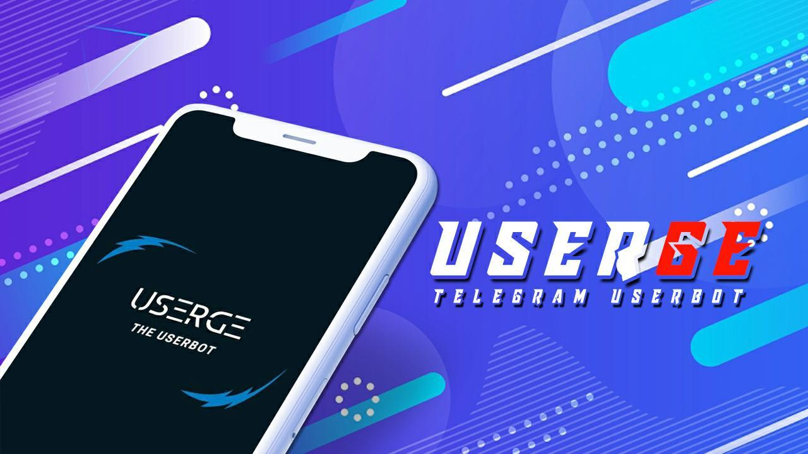

<p align="center">
    <a href="https://github.com/aidilaryanto/uh-seger">
        
    </a>
    <br>
    <b>Pluggable Telegram UserBot</b>
    <br>
    <a href="https://github.com/aidilaryanto/uh-seger#inspiration-">Inspiration</a>
    &nbsp•&nbsp
    <a href="https://github.com/aidilaryanto/uh-seger#features-">Features</a>
    &nbsp•&nbsp
    <a href="https://github.com/aidilaryanto/uh-seger#example-plugin-">Example</a>
    &nbsp•&nbsp
    <a href="https://github.com/aidilaryanto/uh-seger#requirements-">Requirements</a>
    &nbsp•&nbsp
    <a href="https://github.com/aidilaryanto/uh-seger#project-credits-">Project Credits</a>
    &nbsp•&nbsp
    <a href="https://github.com/aidilaryanto/uh-seger#copyright--license-">Copyright & License</a>
</p>

# Uh-Seger 🔥

[](https://travis-ci.com/UsergeTeam/Userge)             [](https://github.com/UsergeTeam/Userge-Plugins) [](https://t.me/theUserge) [](https://deepsource.io/gh/UsergeTeam/Userge/?ref=repository-badge)

> **Uh-Seger** is a Powerful , _Pluggable_ Telegram UserBot written in _Python_ using [Pyrogram](https://github.com/pyrogram/pyrogram).

## Inspiration 😇

> This project is inspired by the following projects :)

* [tg_userbot](https://github.com/watzon/tg_userbot) ( heavily ) 🤗
* [PyroGramUserBot](https://github.com/SpEcHiDe/PyroGramUserBot)
* [Telegram-Paperplane](https://github.com/RaphielGang/Telegram-Paperplane)
* [UniBorg](https://github.com/SpEcHiDe/UniBorg)

> Special Thanks to all of you !!!.

## Features 😍

* Powerful and Very Useful **built-in** Plugins
  * gdrive [ upload / download / etc ] ( Team Drives Supported! ) 🤥
  * zip / tar / unzip / untar / unrar
  * telegram upload / download
  * pmpermit / afk
  * notes / filters
  * split / combine
  * gadmin
  * plugin manager
  * etc...
* Channel & Group log support
* Database support
* Build-in help support
* Easy to Setup & Use
* Easy to add / port Plugins
* Easy to write modules with the modified client

## Example Plugin 🤨

```python
from userge import userge, Message

LOG = userge.getLogger(__name__)  # logger object

CHANNEL = userge.getCLogger(__name__)  # channel logger object

@userge.on_cmd("test", about="help text to this command")  # adding handler and help text to .test command
async def testing(message: Message):
   LOG.info("starting test command...")  # log to console

   await message.edit("testing...", del_in=5)  # this will be automatically deleted after 5 sec

   await CHANNEL.log("testing completed!")  # log to channel
```

## Requirements 🥴

* Python 3.7 or Higher 👻
* Telegram [API Keys](https://my.telegram.org/apps)
* Google Drive [API Keys](https://console.developers.google.com/)
* MongoDB [Database URL](https://cloud.mongodb.com/)

## How To Deploy 👷

* **[HEROKU](https://www.heroku.com/) Method** 🔧

  > First click the button below. 

  > If you don't have HU_STRING_SESSION just ignore it.  

  > After Deployed to Heroku first turn off the app (resources -> turn off) and run `bash genStr` in console (more -> run console).  

  > After that copy the string session and past it in Config Vars (settings -> reveal config vars). 

  > Finally turn on the app and check the logs (settings -> view logs) :)

  [](https://heroku.com/deploy?template=https://github.com/aidilaryanto/uh-seger/tree/master)

* **Other Method** 🔧

  ```bash
  # clone the repo
  git clone https://github.com/aidilaryanto/uh-seger.git
  cd uh-seger

  # create virtualenv
  virtualenv -p /usr/bin/python3 venv
  . ./venv/bin/activate

  # install requirements
  pip install -r requirements.txt

  # Create config.env as given config.env.sample and fill that
  cp config.env.sample config.env

  # get string session and add it to config.env
  bash genStr

  # finally run the Userge ;)
  bash run
  ```

* **[More Detailed Guide](https://docs.google.com/document/d/15uoiOn2NkN518MMkx9h5UaMEWMp8aNZqJocXvS0uI6E)** 📝

> TODO: add Docker Support.

## Generate String Session
Easy way to generate string session on Repl.it:

<p align="center"><a href="http://string.projectdils.repl.run"> </a></p>


### Video Tutorial 🎥

  [](https://youtu.be/-XJj686zeiY "Tutorial")

### Support & Discussions 👥

> Head over to the [Discussion Group](https://t.me/slbotsbugs) and [Update Channel](https://t.me/theUserge)

### Project Credits 💆‍♂️

* [Specially to these projects](https://github.com/UsergeTeam/Userge#inspiration-) 🥰
* [@uaudIth](https://t.me/uaudIth)
* [@K_E_N_W_A_Y](https://t.me/K_E_N_W_A_Y)
* [@nawwasl](https://t.me/nawwasl)
* [@TharukaN97](https://t.me/TharukaN97)
* [@Supun97](https://t.me/Supun97)
* [@gotstc](https://t.me/gotstc)

### Copyright & License 👮

* Copyright (C) 2020 by [UsergeTeam](https://github.com/UsergeTeam) ❤️️
* Licensed under the terms of the [GNU GENERAL PUBLIC LICENSE Version 3, 29 June 2007](https://github.com/UsergeTeam/Userge/blob/master/LICENSE)
